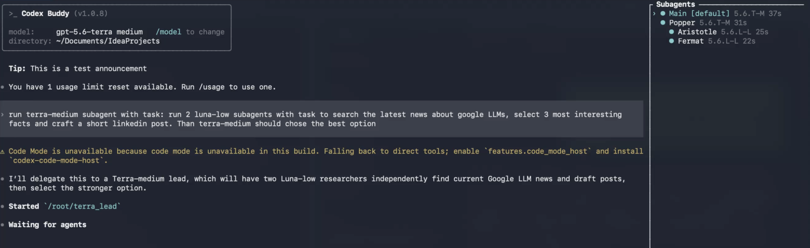

# Codex Buddy ⚡

Codex Buddy is a lightweight, coding-focused fork of the Codex CLI. It keeps the interactive TUI, headless `exec`, review, resume/fork, authentication, sandboxing, apply-patch, and explicitly configured MCP workflows while removing or deferring non-coding runtime surface.

## At a glance 📉

| Same MacBook, idle for 2 minutes | Standard Codex CLI | Codex Buddy |
| --- | ---: | ---: |
| RAM (RSS) | 95.0 MB | **33.4 MB** |
| Initial context used | 13% | **5%** |

These are exploratory, same-machine measurements—not release guarantees. See [evidence](#evidence-so-far-) for the workload measurements and method.

## Features ✨



*A live nested task in Codex Buddy v1.0.8. The right-side tree stays pinned while the transcript
scrolls independently.*

| Feature | What it provides |
| --- | --- |
| Pinned hierarchical agent tree | Shows the main agent, children, and nested children beside the transcript on wide terminals |
| Automatic agent identity | Displays generated agent names and roles as soon as their metadata arrives—no `/subagents` refresh required |
| Live execution context | Adds compact model/reasoning labels such as `5.6.T-M` and per-agent elapsed runtimes |
| Lifecycle visibility | Distinguishes running, waiting, completed, failed, interrupted, approval, and input-required states |
| Task-scoped cleanup | Starts each new root task with a fresh panel while retaining the current task's completed agents for long runs |
| Independent transcript navigation | Keeps the tree fixed while Arrow, Page Up/Down, Home, and End scroll the main output; popup menus keep control of their own navigation keys |
| Agent switching | Preserves the `/subagents` picker and keyboard traversal across discovered agents in stable spawn order |
| Buddy-native session UX | Uses Codex Buddy branding and versioning in the TUI and terminal title, then prints token usage and the Buddy resume command on exit |
| Coding-first Codex workflows | Keeps interactive chat, `exec`, review, resume/fork, authentication, sandboxing, apply-patch, project instructions, skills, and explicitly configured MCP servers |

## Install

Install from source on macOS, Linux, or Windows. You need Git and a current Rust toolchain
(`rustup` is recommended; install it from [rustup.rs](https://rustup.rs) if needed):

```shell
git clone https://github.com/AlexeyPlatkovsky/codex-buddy.git
cd codex-buddy/codex-rs
cargo install --locked --path codex-buddy
```

This installs the `codex-buddy` executable into Cargo's user bin directory (normally
`~/.cargo/bin`). Ensure that directory is on your `PATH`, then verify the installation:

```shell
codex-buddy --version
codex-buddy
```

If the version is still `0.0.0`, check which executable your shell is using:

```shell
which -a codex-buddy
```

Your shell may find an older copy (for example, `~/bin/codex-buddy`) before the newly installed
one. Replace that preferred copy atomically with the path matching your installation method, then
refresh the shell command cache. Atomic replacement also avoids a stale macOS code-signing state
that can otherwise terminate the executable with `zsh: killed`:

```shell
# For `cargo install`:
install -m 755 ~/.cargo/bin/codex-buddy ~/bin/.codex-buddy.new
# For the system-wide install below:
# install -m 755 /usr/local/bin/codex-buddy ~/bin/.codex-buddy.new
mv -f ~/bin/.codex-buddy.new ~/bin/codex-buddy
hash -r
codex-buddy --version
```

To install a release binary system-wide on macOS or Linux instead:

```shell
cd codex-buddy/codex-rs
cargo build --locked --release -p codex-buddy
sudo install -m 755 target/release/codex-buddy /usr/local/bin/.codex-buddy.new
sudo mv -f /usr/local/bin/.codex-buddy.new /usr/local/bin/codex-buddy
```

The macOS DMG is a CLI binary, not a `.app`: mount it, copy `codex-buddy` to a directory on
your `PATH`, then run `codex-buddy`.

## What is different? 🧭

| Area | Standard Codex CLI | Codex Buddy |
| --- | --- | --- |
| Focus | Full product surface | Coding workflows first |
| Command | `codex` | `codex-buddy` |
| Code Mode | Available when supplied by the full build | Intentionally excluded; direct tools are used instead |
| Heavy surfaces | May include apps, plugins, browser/computer automation, cloud, voice, and generation features | Removed or not constructed in the coding runtime profile |
| MCP and skills | Full discovery/composition | Explicit configuration and project instructions only |

⚠️ Code Mode cannot be enabled by a configuration key in the compact Buddy binary: it is a compile-time dependency choice. A future full Buddy variant would need a separate build and the `codex-code-mode-host` helper.

## Evidence so far 🧪

All figures below are exploratory macOS arm64 measurements, not release gates or promises. The full ideal comparison still requires the dedicated Linux runner recorded in the roadmap.

| Measure | Standard / baseline | Buddy | Change |
| --- | ---: | ---: | ---: |
| Release binary | 987.3 MB | 967.5 MB | -2.0% |
| First verified TUI frame | 106.7 ms | 107.1 ms | no meaningful change |
| RSS at first TUI output | 23,356 KiB | 23,052 KiB | -1.3% |
| RSS after a four-phone web-research task | 97–134 MB, including Code Mode host | 66.7 MB | -31% to -50% |
| First request payload | 71,691 B | 62,560 B | -12.7% |
| First request with the opt-in minimal root prompt | 71,691 B | 42,417 B | -40.8% |
| Root-instruction portion with the minimal prompt | 21,209 B | 1,066 B | -95.0% |

The minimal prompt is an opt-in experiment, not the default release setting. It reduced the initial request by about 7,318 approximate tokens in this harness.

The two RSS rows are manual measurements on the same MacBook, using the same model and a user-root working directory. The standard CLI runtime range includes its approximately 8.9 MB `codex-code-mode-host` helper when present; RSS naturally varies during tool use, so this is a representative range rather than a release guarantee.

## Quality checks ✅

Real authenticated-model runs compare installed Codex CLI 0.151.0 with Buddy using deterministic local graders. Buddy passed all repeated, supported cases:

| Scenario, three macOS runs | Codex | Buddy |
| --- | ---: | ---: |
| Multi-step fix, changelog, and tests | 2/3 | 3/3 |
| Retry after a forced transient tool failure | 3/3 | 3/3 |
| Follow a project `AGENTS.md` → `SKILL.md` instruction | 3/3 | 3/3 |
| Nearest scoped `AGENTS.md` instruction | 3/3 | 3/3 |

⚠️ The local CLI benchmark does not yet score subagent delegation or a real approval/sandbox
denial. The subagent tree itself has focused app-server routing, interaction, and rendering tests in
addition to live TUI verification.

## Versioning 📌

Buddy releases use Semantic Versioning: patch for compatible fixes, minor for user-visible Buddy features, and major for incompatible changes. Upstream merges are assessed for user-visible impact before the next Buddy release version is chosen. Run `scripts/buddy_release/install_git_hooks.sh` once to enable the local pre-commit version guard; GitHub checks the same rule.

## References

- [Migration roadmap](MIGRATION_ROADMAP.md)
- [Performance and payload harness](scripts/buddy_release/compare_e2e_performance.py)
- [Prompt-quality benchmark](scripts/buddy_release/compare_prompt_quality.py)

This repository is licensed under the [Apache-2.0 License](LICENSE).
